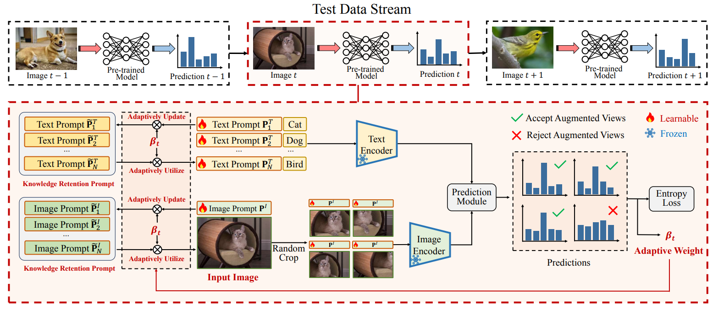
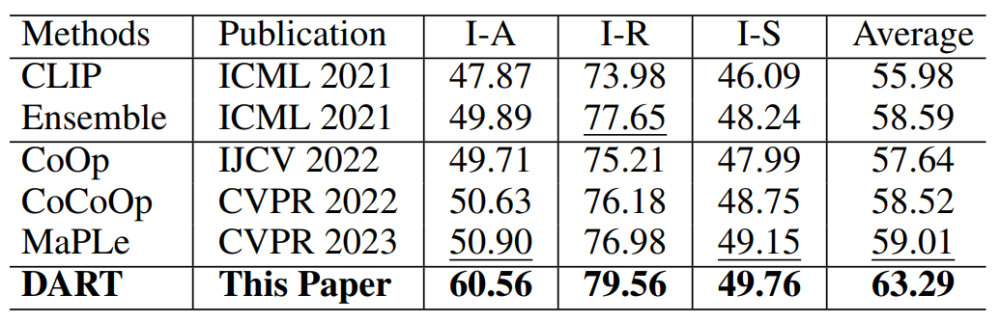
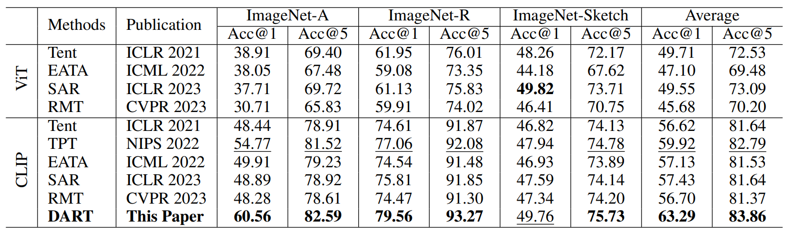

<p align="center">
<a href="https://github.com/zhoujiahuan1991/AAAI2024-DART"></a>
</p>
### Introduction
This is the *official* repository of our AAAI 2024 paper "DART: Dual-Modal Adaptive Online Prompting and Knowledge Retention for Test-Time Adaptation". 

For more details, please check out our [paper](https://ojs.aaai.org/index.php/AAAI/article/view/29320).




### Environment
This code is based on pytorch2.0.1, pytorch-cuda11.8, and torchvision0.15.2.

For a complete configuration environment, see environment.yaml

### Data
You should download [ImageNet-A](https://github.com/hendrycks/natural-adv-examples), [ImageNet-R](https://github.com/hendrycks/imagenet-r) and [ImageNet-Sketch](https://github.com/HaohanWang/ImageNet-Sketch) first.


Then your data directory should be organized in the following format:

- **you_data_path**
  - *imagenet-a*
  - *imagenet-r*
  - *imagenet-sketch*


### DART
Taking the ImageNet-A dataset as an example, you can run the following command:
```
python ./main.py your_data_path --test_sets A  --tpt --myclip  --text_prompt_ema --text_prompt_ema_one_weight --text_prompt_ema_one_weight_h=5000 --text_prompt_ema_w=0.1 --image_prompts --image_prompt_ema=4 --image_prompt_ema_h=5000 --image_prompt_ema_w=0.1 --info=A/This_CSTP-aEMA-h=5000-w=0.1-CSIP-r-aEMA-h=5000-w=0.1 --resize_flag=True --resize=410 --resolution=224
```

### Results
The following results were obtained with a single NVIDIA 4090 GPU.

The Acc@1 comparison results against CLIP and the latest few-shot fine-tuning methods on three benchmark datasets. The I-A, I-R, and I-S represent ImageNet-A, ImageNet-R, and ImageNet-Sketch respectively.




The comparison results against state-of-the-art TTA methods on three benchmark datasets. ViT represents the ViT-B/16 model pre-trained on ImageNet, and CLIP represents the pre-trained CLIP model with ViT-B/16 architecture.




### Citation
If you find this code useful for your research, please cite our paper.
```
@inproceedings{liu2024dart,
  title={DART: Dual-Modal Adaptive Online Prompting and Knowledge Retention for Test-Time Adaptation},
  author={Liu, Zichen and Sun, Hongbo and Peng, Yuxin and Zhou, Jiahuan},
  booktitle={Proceedings of the AAAI Conference on Artificial Intelligence},
  volume={38},
  number={13},
  pages={14106--14114},
  year={2024}
}
```


### Acknowledgement
Our code is based on the PyTorch implementation of [TPT](https://github.com/azshue/TPT).

### Contact
For any questions, feel free to contact us ([lzc20180720@stu.pku.edu.cn](lzc20180720@stu.pku.edu.cn)).

Welcome to our Laboratory Homepage ([OV<sup>3</sup> Lab](https://zhoujiahuan1991.github.io/)) for more information about our papers, source codes, and datasets.
